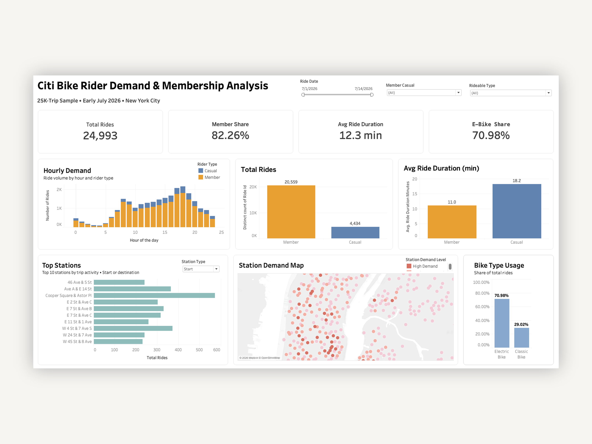

# Citi Bike Rider Demand & Membership Analysis

**Tableau · PostgreSQL · SQL**

## Project Overview

An end-to-end analysis of nearly 25,000 Citi Bike trips to identify rider behavior, peak demand periods, station activity, and bike-type preferences across New York City.

[View Live Dashboard](https://public.tableau.com/app/profile/nisarga.jayaprakash/viz/Citi_Bike_Demand_Rider_Analysis/CitiBikeDemandRiderAnalysis)

## Technical Implementation

This repository contains the analytical code and dashboard development work supporting the project.
